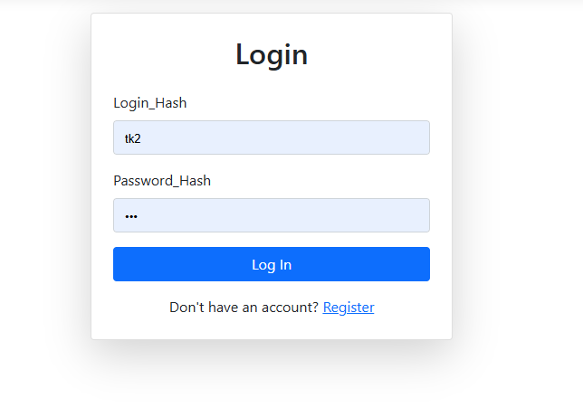
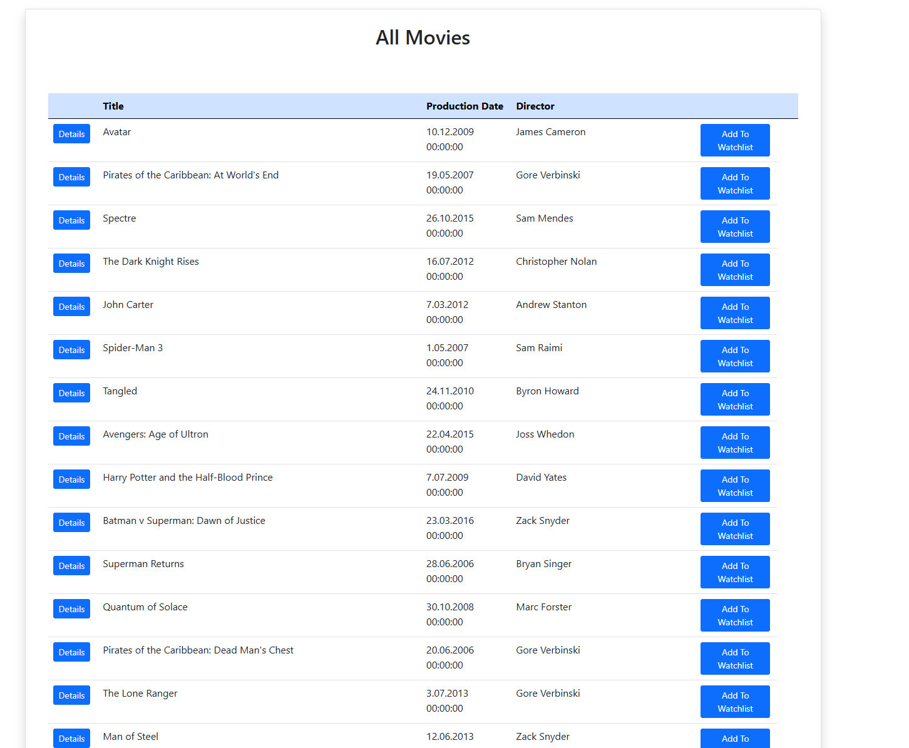
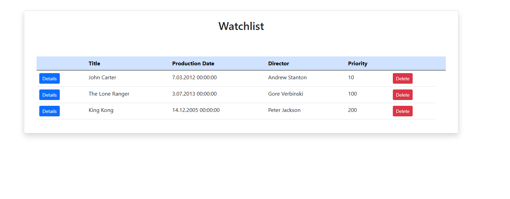
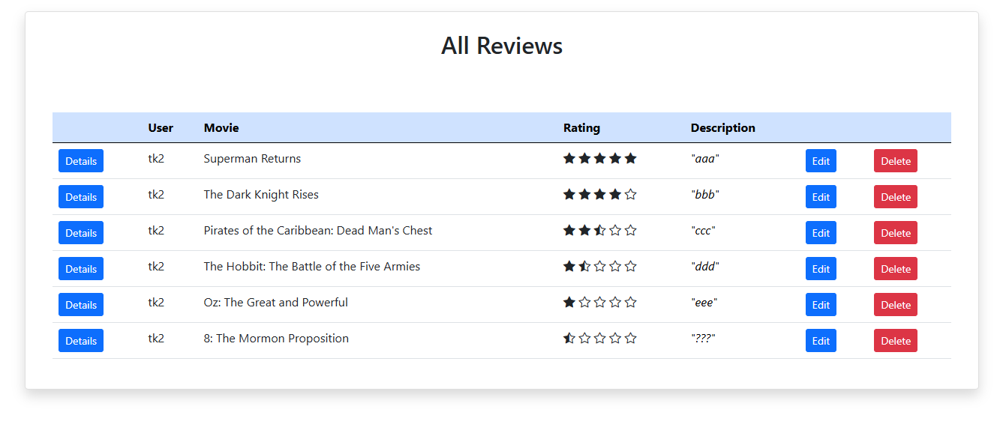
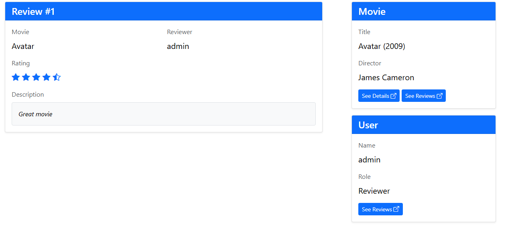
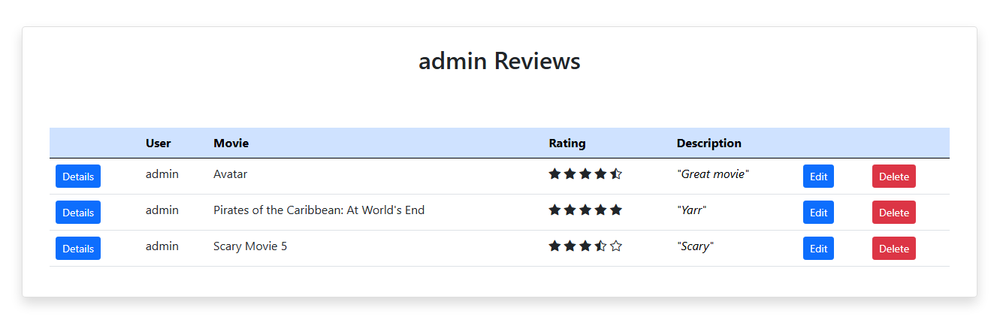
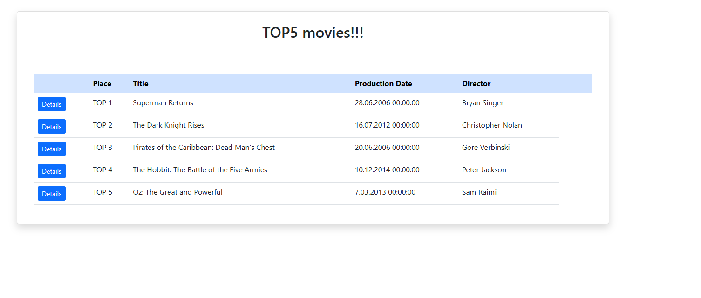
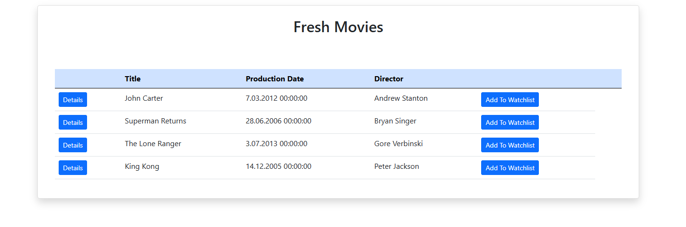

# RottenPotatoes
### Autorzy:
- Jarosław Klima
- Paweł Knot

## Opis
RottenPotatoes to aplikacja, która pomoże ci wybrać twój następny film! 
- Możesz przeglądać opisy filmów oraz ich oceny od innych użytkowników
- Pozwala ci samemu dodawać własne oceny i recenzje
- Pozwala ci utworzyć listę filmów do oglądania na przyszłość i poleci film z największym priorytetem

## Przypadki użycia

### Logowanie i Rejestracja
- Jest to początkowy widok, który jest obecny po pierwszym wejściu na stronę
- Żeby przejść do reszty treści trezba podać login i hasło lub utworzyć nowe konto, także podając login i hasło

### Movies
- Jest to lista wszystkich filmów dostępnych w naszym serwisie
- Można wejść w ich szczegóły lub dodać je do watchlisty

### Watchlist
- Jest to lista wybranych filmów z których każdy ma swój priorytet i ten o największym priorytecie będzie wyświetlany jako pierwszy
- Można oczywiście wchodzić w ich szczegóły i usuwać je z watchlisty

### Reviews
- Jest to lista wszystkich recenzji na temat filmów
- Można wystawić własną recenzję za pomocą post Review
- Można też edytować i usuwać napisane przez siebie recenzje

### Review Details
- Klikając przycisk **Details** opnii, możemy zobaczyć jej szczegóły

### User's Reviews
- Istnieje również możliwość zobaczenia zestawienie opnii danego użytkownika

### TOP5 
- Wyświetla 5 najlepiej ocenianych filmów w serwisie
- Jeśli nie ma wystarczająco recenzji, to wyświetli ich mniej

### Fresh
- Wyświetla najczęsciej występujące na watchlistach filmy
- Liczba filmów jest ograniczona do 10

### Account
- Wyświetla dane o koncie użytkownika, w tym klucz API
